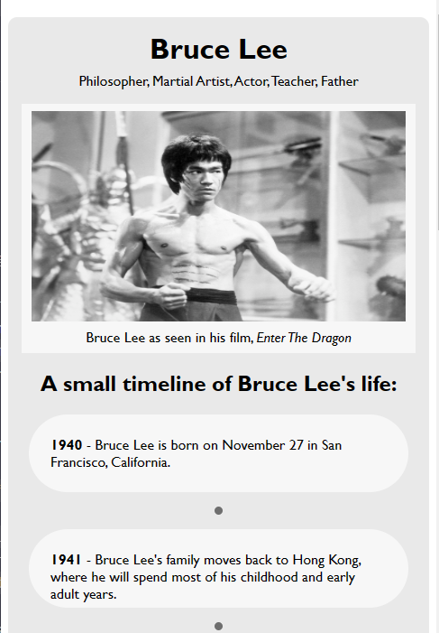

# FreeCodeCamp - Tribute Page

This is a solution to the [freeCodeCamp Tribute Page Portfolio Project](https://www.freecodecamp.org/learn/2022/responsive-web-design/build-a-tribute-page-project/build-a-tribute-page).  

## Table of contents

- [Overview](#overview)
  - [Screenshot](#screenshot)
  - [Links](#links)
- [My process](#my-process)
  - [Built with](#built-with)
  - [What I learned](#what-i-learned)
  - [Continued development](#continued-development)
  - [Useful resources](#useful-resources)
- [Author](#author)

## Overview

### Screenshot

### Links

- Solution URL: [https://github.com/Dwayne-Lacey/tribute-page](https://github.com/Dwayne-Lacey/tribute-page)
- Live Site URL: [https://dwayne-lacey.github.io/tribute-page/](https://dwayne-lacey.github.io/tribute-page/)

## My process

### Built with

- Semantic HTML5 markup
- CSS custom properties

### What I learned

A key thing that I gained confidence in during this project was the box model as well as how to use the border-radius property. I really struggled at first with understanding how to properly center all of my elements and how to keep them proper sizes at different view-wdiths. Eventually I started to learn to set my actual widths using my base width and then the scaled up widths using a max-width measured in pixels. To fix my border-radius and get a circular rather than elliptical rounding, I learned that the border-radius property actually takes two arguments in order to specify how round it is. 

### Continued development

In the future I would like to get better at planning out in advance how I'll organize my elements and I'd like to better understand how to get the most out of using flexbox. I also feel ready to begin learning React and Bootstrap to help with my styling.

### Useful resources

- [W3Schools](https://www.w3schools.com/css/css_align.asp) - I've used W3Schools before, but their resources on their site helped me tremendously in understanding the necessary syntax in CSS
- [StackOverflow](https://developer.mozilla.org/en-US/docs/Learn/CSS/CSS_layout/Flexbox) - I tend to use StackOverflow a LOT and in this case, I learned a lot about how to properly center my elements and about the specific properties of a handful different elements I worked with.

## Author

- Frontend Mentor - [@Dwayne-Lacey](https://www.frontendmentor.io/profile/Dwayne-Lacey)
- Dev.To - [@dlacey](https://dev.to/dlacey)

